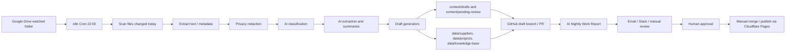

# 06_AUTOMATION — XRM Intelligence 自动化引擎

XRM Intelligence 系统的自动化基础设施。所有 AI 自动化工作流、脚本、提示词均在此目录管理。

## 自动化输出路径（新结构）

- AI 生成草稿 → `03_CONTENT/_drafts/`
- 情报报告 → `04_INTELLIGENCE/nightly-reports/`
- 供应商数据 → `01_DATABASES/suppliers/`
- 项目数据 → `02_PROCUREMENT/active-projects/`
- 已发布内容存档 → `03_CONTENT/seo-articles/` 或 `03_CONTENT/website-copy/`

## 子目录说明

- `prompts/` — AI 提示词（供 Claude / n8n 调用）
- `scripts/` — Python 辅助脚本
- `n8n/` — n8n 工作流 JSON
- `runbooks/` — 操作手册
- `setup/` — 服务配置文档
- `test-files/` — 测试样本数据

---
*以下为原始系统架构文档（保留，路径已更新为新结构）*

## System Architecture



## Folder Structure

```text
automation/
  README.md
  n8n/
    nightly-ai-workflow.json
  prompts/
    file-classifier.prompt.md
    supplier-extractor.prompt.md
    hotel-procurement-extractor.prompt.md
    website-article-writer.prompt.md
    social-content-writer.prompt.md
    daily-report-writer.prompt.md
    privacy-redaction.prompt.md
  reports/
    nightly-report-template.md
  scripts/
    privacy_redaction.py
    generate_review_checklist.py

content/
  drafts/
  pending-review/

data/
  suppliers/
  projects/
  knowledge-base/
  schemas/
    suppliers.schema.md
    hotel-procurement.schema.md
    ai-infrastructure.schema.md
    website-drafts.schema.md
    daily-actions.schema.md
```

## Data Flow

1. n8n runs every night at 22:00.
2. Google Drive is searched for files created or modified since the start of the current day.
3. File metadata and extracted text are normalized into a single AI input object.
4. Sensitive information is redacted before any supplier-facing or website-facing draft is generated.
5. Files are classified into the required business categories.
6. AI extracts supplier, hotel procurement, AI infrastructure, website, and daily action signals.
7. Draft outputs are written to review-only paths.
8. n8n commits changes to a draft branch or opens a pull request.
9. A nightly report and checklist are sent to the reviewer.
10. The website is published only after manual approval and merge.

## Module Responsibilities

- n8n: scheduling, orchestration, credentials, notifications, and failure routing.
- Google Drive: source file intake.
- AI analysis nodes: classification, extraction, summarization, drafting, and redaction checks.
- `automation/prompts/`: stable, reviewable prompt source.
- `automation/scripts/`: local helper scripts for privacy checks and review checklist generation.
- `content/drafts/`: generated website/article/social drafts that are not ready for publication.
- `content/pending-review/`: reviewed by human before merge or publication.
- `data/`: structured CSV/JSON/Markdown-compatible records for suppliers, projects, knowledge, and actions.
- GitHub: version control, branch protection, pull request review, rollback.
- Cloudflare Pages: deployment only from the approved production branch.

## Required Environment Variables

Use n8n credentials where possible. Store local examples in `.env.example`, never `.env`.

```text
GOOGLE_DRIVE_WATCH_FOLDER_ID=
GOOGLE_DRIVE_PROCESSED_FOLDER_ID=
GOOGLE_DRIVE_REPORT_FOLDER_ID=
OPENAI_API_KEY=
GITHUB_OWNER=
GITHUB_REPO=
GITHUB_TOKEN=
GITHUB_DRAFT_BRANCH_PREFIX=ai-nightly-draft
GITHUB_BASE_BRANCH=main
REVIEW_NOTIFICATION_EMAIL=
N8N_WEBHOOK_BASE_URL=
CLOUDFLARE_ACCOUNT_ID=
CLOUDFLARE_PAGES_PROJECT=
```

## Manual API Key / Token Setup

- Google Drive OAuth credential in n8n with read access to the watched folder.
- OpenAI API key or another approved AI provider key in n8n.
- GitHub fine-grained token with repository contents and pull request permissions.
- Email, Slack, or other notification credential for review report delivery.
- Cloudflare Pages account/project configured to deploy only from the approved branch.

## Nightly Operation

At 22:00, n8n runs `automation/n8n/nightly-ai-workflow.json`. It collects new files, performs privacy checks, generates drafts, and prepares a GitHub PR or draft branch. If any high-risk privacy issue or processing error occurs, the workflow stops before pushing changes.

## Morning Review

Review in this order:

1. Open the GitHub PR or draft branch.
2. Read the report in `automation/reports/` or the notification message.
3. Check `content/pending-review/` drafts.
4. Check generated data rows against source documents.
5. Confirm no sensitive information appears in supplier-facing or website-facing text.
6. Edit drafts manually if needed.
7. Merge only after review is complete.

## Approving Website Publication

Publication is manual:

1. Move approved content from `content/pending-review/` into the real website/blog location that your site generator uses.
2. Keep old pages and images.
3. Commit with a clear human approval message.
4. Merge into the Cloudflare Pages production branch.
5. Confirm the Cloudflare Pages deployment preview before production.

## Rollback

Use GitHub history:

1. Find the PR or commit that introduced the generated content.
2. Revert that commit or PR.
3. Cloudflare Pages will redeploy the previous state after the revert is merged.

Do not delete old files manually unless you have a separate archive plan.

## Adding New Google Drive Folders

Add the folder ID to the n8n workflow configuration or clone the Google Drive scan node. Keep each folder mapped to one business purpose, such as suppliers, hotel projects, website materials, or AI infrastructure.

## Turning Off Automation

Disable the n8n workflow. For extra safety, also revoke the GitHub token or remove repository write permissions from the n8n credential.

## Troubleshooting

- No files found: check Google Drive folder ID and OAuth permissions.
- AI output missing: check AI credential, model name, and node error output.
- PR not created: check GitHub token permissions and base branch name.
- Cloudflare published unexpectedly: check Cloudflare Pages production branch settings. It should not deploy draft branches to production.
- Sensitive data leaked in draft: treat the run as failed, do not merge, update `automation/prompts/privacy-redaction.prompt.md`, and rerun.
- Word/Excel/PDF mismatch: regenerate from the same structured source data and compare record counts before review.

## Safety Rules

- Draft only. Never auto-publish.
- Never delete old pages.
- Never overwrite old content.
- Never delete old images.
- Put generated content in draft or pending-review paths.
- Mark generated content with `generated-by-ai`.
- Create a run log and review checklist for every run.
- Stop before push if extraction, redaction, or validation fails.

## Office Document Compatibility

- Generate Word, Excel, and PDF outputs from the same structured JSON/CSV source data so the numbers and wording stay consistent.
- Use Windows Microsoft Office 365/2021-compatible formats only: `.docx`, `.xlsx`, `.pdf`, `.csv`, `.md`, `.txt`.
- Do not use Pages, Numbers, or Keynote formats.
- Do not use Mac-specific fonts. Prefer Arial, Calibri, Aptos, Times New Roman, or Noto Sans CJK for Chinese/English mixed documents.
- Before sending any document externally, compare source row counts, totals, supplier names, product names, and privacy redaction status across Word, Excel, and PDF versions.
