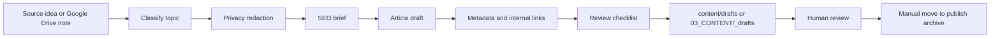

# Automatic Blog Publishing Pipeline

## Goal

Create a repeatable AI-assisted blog pipeline that prepares SEO drafts but never publishes without review.

## Pipeline



## Input Sources

- Google Drive `Incoming Notes`
- Supplier research notes
- RFQ lessons learned
- Market trend notes
- Website content ideas

## Draft Output Format

```markdown
---
generated-by-ai: true
status: pending-review
content-type: seo-blog-draft
target-keyword:
seo-title:
meta-description:
suggested-slug:
privacy-reviewed: required
---

# H1
```

## Required Human Checks

- Accuracy
- Confidentiality
- Buyer fit
- SEO metadata
- Internal links
- CTA
- No duplicate existing page

## Publication Rule

The automated workflow stops at pending review. A human must move the draft into the live content path and commit the approval.
