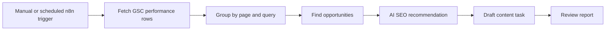

# Google Search Console Integration Plan

## Goal

Prepare Google Search Console data usage for SEO decisions without changing production DNS or publishing settings.

## Data to Collect

- Query
- Page
- Country
- Device
- Clicks
- Impressions
- CTR
- Average position
- Date range

## Planned Workflow

## Opportunity Rules

- High impressions, low CTR: improve title/meta.
- Average position 8-20: expand content and internal links.
- Relevant queries without a matching page: create draft article brief.
- Traffic to wrong page: add internal link or clarify page positioning.

## Credentials Needed Later

- Google Search Console API enabled.
- OAuth credential with readonly Search Console scope.
- Verified property for `xrmglobalhk.com`.

## Current Status

Prepared only. Do not change DNS verification while the Cloudflare issue is pending.
