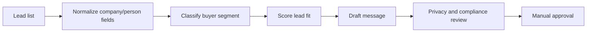

# LinkedIn Lead Generation Workflow

## Goal

Prepare a compliant, review-first LinkedIn lead generation workflow for overseas buyers, contractors, hotel developers, procurement managers, and data center infrastructure buyers.

## Lead Sources

- Public LinkedIn search exports
- Event attendee lists provided by the user
- Website inquiry forms
- Manual prospect lists
- Google Sheets CRM rows

## Lead Segments

- Hotel developers
- Hotel procurement managers
- FF&E consultants
- Contractors and EPC firms
- Data center builders
- AI infrastructure buyers
- Southeast Asia project owners

## Workflow

## Safety Rules

- Do not scrape private data.
- Do not auto-send LinkedIn messages.
- Do not imply a relationship or endorsement.
- Do not include confidential client/project information.
- Store outreach drafts as pending review.

## Output Fields

- lead_name
- company
- role
- country
- segment
- buyer_intent
- fit_score
- suggested_message
- follow_up_angle
- review_status

## Message Positioning

Keep messages short, specific, and relevant to the buyer's business. Focus on procurement support, supplier coordination, RFQ comparison, and export readiness.
