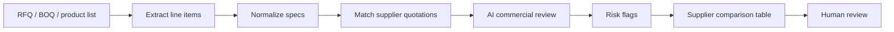

# RFQ to AI Review to Supplier Comparison Workflow

## Goal

Turn buyer RFQs, supplier quotations, and product specs into a reviewable supplier comparison package.

## Workflow

## Input File Types

- PDF
- Word
- Excel
- Images
- TXT / Markdown

## Key Review Dimensions

- Product match
- Specification completeness
- MOQ
- Unit price
- Currency
- Lead time
- Packaging
- Warranty
- Certification
- Export readiness
- Payment terms
- Risk notes

## Output Package

- Supplier comparison CSV
- Supplier comparison Markdown report
- RFQ clarification questions
- Missing information list
- Recommended supplier shortlist
- Human review checklist

## Safety Rules

- Do not send supplier-facing content automatically.
- Do not expose client names in supplier-facing drafts.
- Do not overwrite previous comparison files.
- Create dated output folders for each RFQ.
